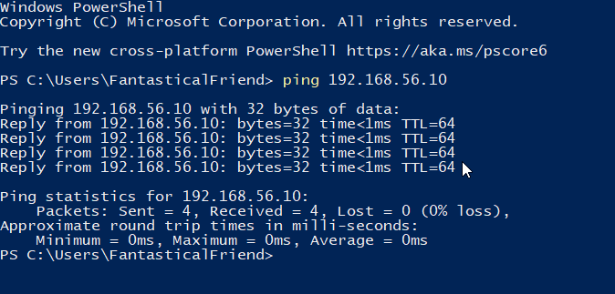
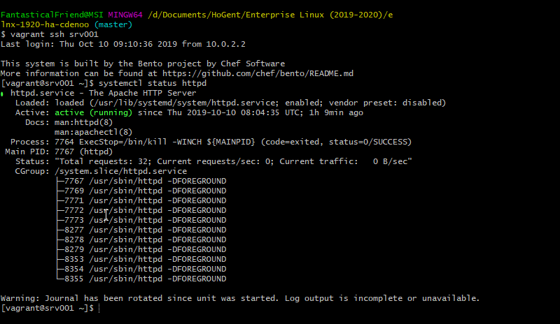
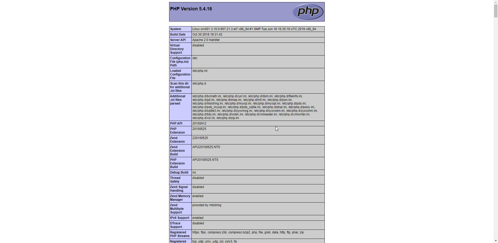
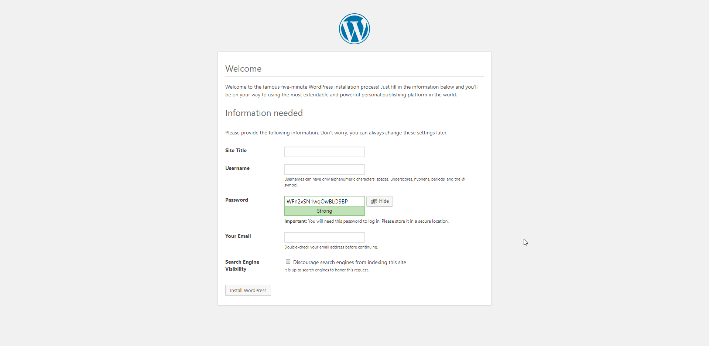
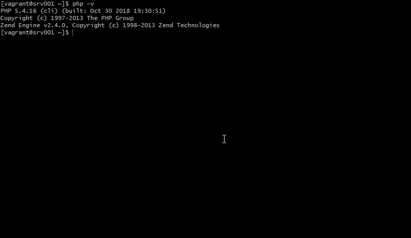
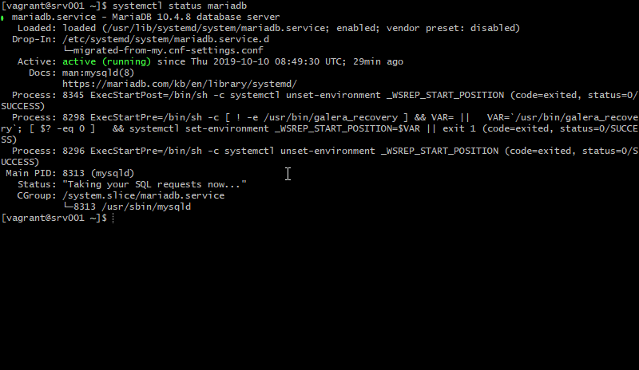
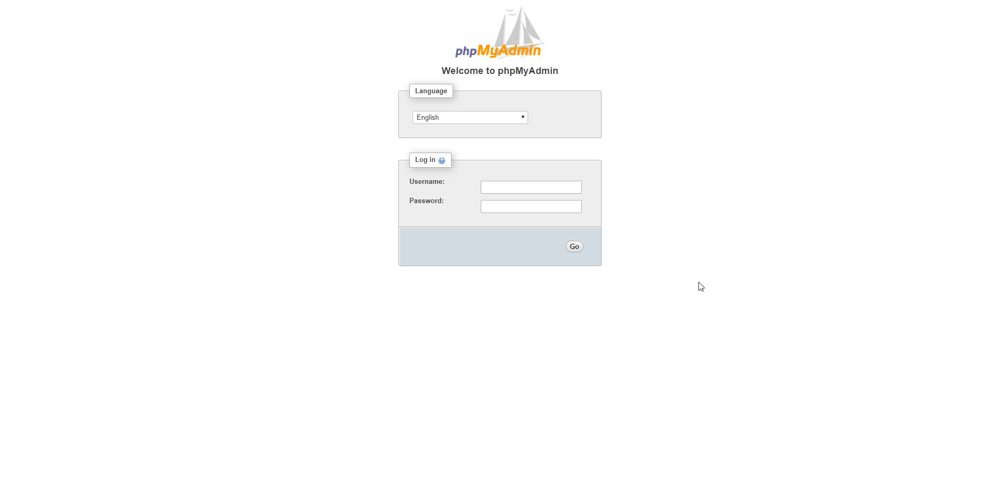
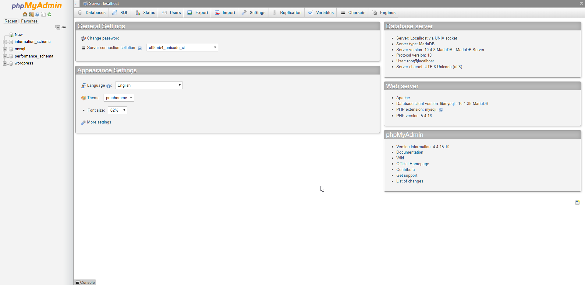

# Enterprise Linux Lab Report

- Student name: Cedric Denoo
- Github repo: <https://github.com/HoGentTIN/elnx-1920-ha-cdenoo.git>

Opzetten lamp-stack met wordpress geinstalleerd.

## Requirements

- srv001: Webserver is van buitenaf bereikbaar (host naar guest)
- srv001: Apache webserver draait en toont de php testpagina op http://192.168.56.10/ en wordpress op http://192.168.56.10/wordpress
- srv001: Mariadb draait en is juist geconfigureerd (paswoorden)
- srv001: PHP is geinstalleerd en werkt, bevestigd door de php testpagina op http://192.168.56.10/

## Test plan

### Beschikbaarheid
- open terminal op host
- run commando `ping 192.168.56.10`
- als de server reageert en pongs terugstuurt is de test geslaagd

### Apache
1. Systemctl
- ssh naar terminal srv001
- run commando `systemctl status httpd`
- als service httpd op "Active: active (running)" staat is de eerste test geslaagd
2. Webpaginas
- open browser en surf naar http://192.168.56.10/
- open browser en surf naar http://192.168.56.10/wordpress
- als beide webpaginas beschikbaar zijn, is de test geslaagd

### PHP
1. Terminal
- ssh naar terminal srv001
- run commando `php -v`
- als de output een versie van php weergeeft is de test geslaagd
2. Webpagina
- open browser en surf naar http://192.168.56.10/
- als de webpagina een overzicht geeft van de installatie van PHP is de test geslaagd

### Mariadb
1. Systemctl
- ssh naar terminal srv001
- run commando `systemctl status mariadb`
- als service httpd op "Active: active (running)" staat is de eerste test geslaagd

2. PHPMyAdmin
- open browser en surf naar http://192.168.56.10/phpmyadmin
- log in met user `root` en paswoord `root_password` zoals geconfigureerd in `/ansible/host_vars/srv001.yml`
- als het phpMyAdmin dashboard tevoorschijn komt is de test geslaagd

3. Wordpress
- open browser en surf naar http://192.168.56.10/wordpress
- als de wordpress configuratie tevoorschijn komt is de test geslaagd

## Documentation

1. Clone base repository van ELNX-HA 
   - 6bedb6c90e83cd49c13f9b92b9a2b878b20cf48a
2. Lamp stack toevoegen van https://github.com/bertvv/lampstack
   - e6e977464d55295703df02db11a4fd2c75a972bc
3. Python script schrijven om vereiste ansible rollen te importeren
   - 21bfb8ba4f19cc6ab82fc4d3c5e838622a9d7490

## Test report

### Beschikbaarheid

### Apache

### PHP

### Mariadb

## Troubleshooting

- Bij creeren nieuwe Host-Only Adapter geeft vagrant een error.
  - Oplossing: Control panel netwerk adapter af en aan zetten

## Resources

- https://github.com/bertvv

- [lynis](https://cisofy.com/lynis/)
- [open-scap](https://www.open-scap.org/)
- [haproxy](http://www.haproxy.org/)
- [icinga](https://icinga.com/)
- [docker](https://www.docker.com/)
- [docker compose](https://docs.docker.com/compose/)
- [kubernetes](https://kubernetes.io/)
- [collectd](https://collectd.org/)
- https://www.tecmint.com/setup-high-availability-clustering-in-centos-ubuntu/
- [grafana](https://grafana.com/)
- [elastic stack](https://www.elastic.co/products/)