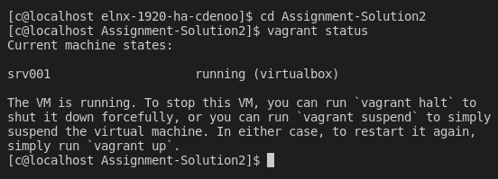
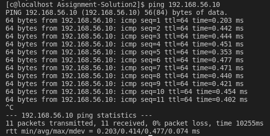
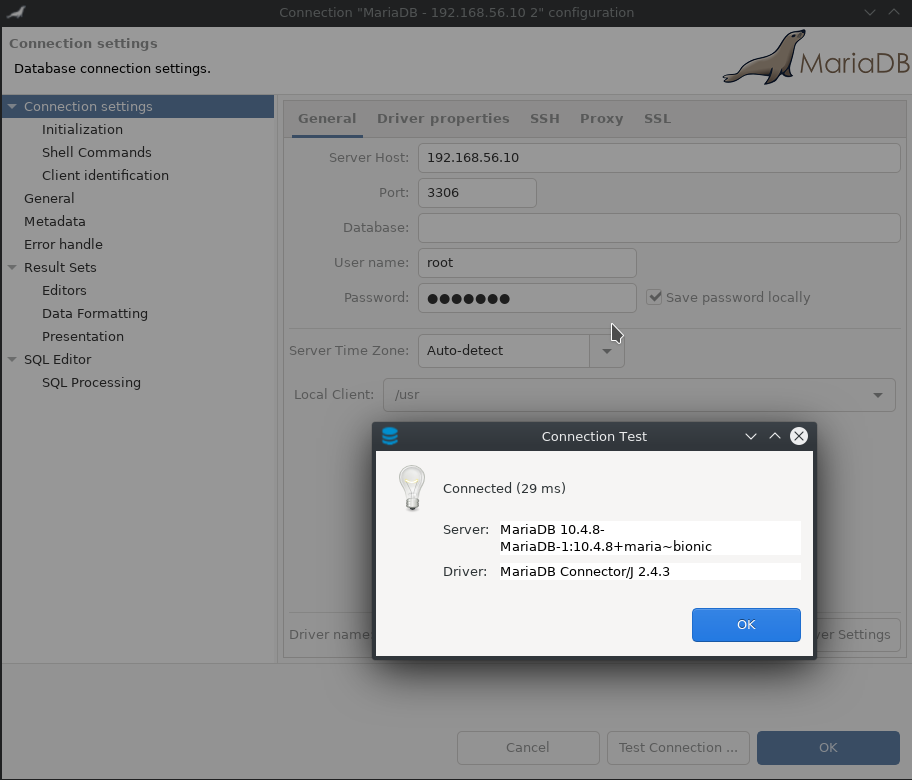
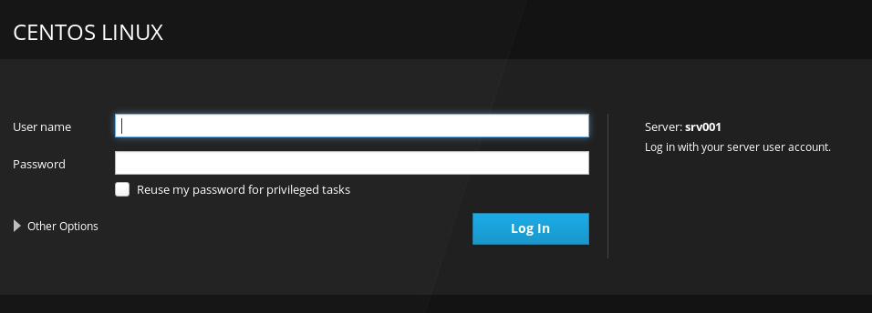
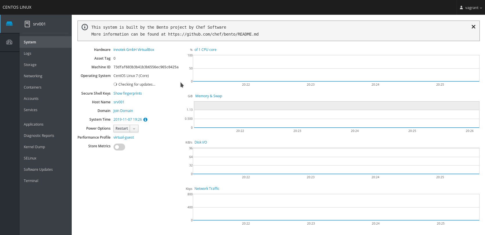
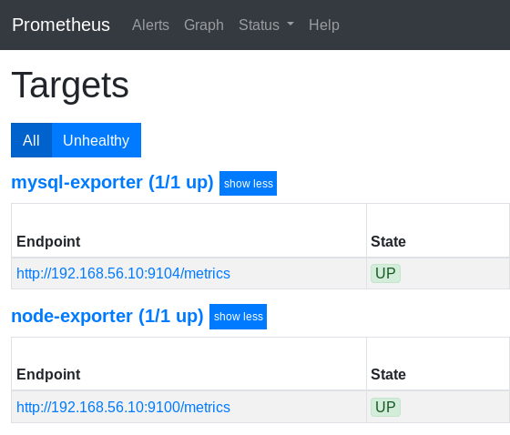
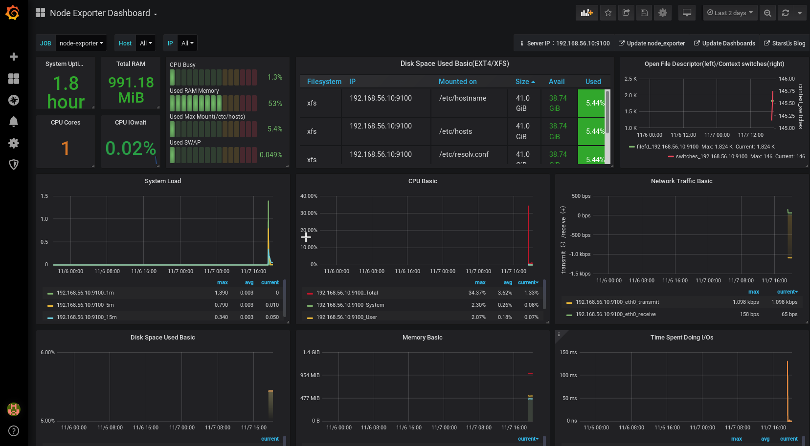

# Enterprise Linux Lab Report

- Student name: Cedric Denoo
- Github repo: <https://github.com/HoGentTIN/elnx-1920-ha-cdenoo.git>

Get all services working in a docker environment.

## Requirements

- Docker runs on VM
- Mariadb runs containerized
- Webserver runs containerized
- A monitoring tool monitors and visualizes hardware state

## Test plan

1. Open terminal and run `cd Assignment-Solution2`

2. Run `vagrant up` and `vagrant status`
```
Expected: Centos-7.6 server running
```
3. Run `ping 192.168.56.10`
```
Expected: Response from server
```
4. Open database client and connect to `192.168.56.10:3306` with user `root` and password `example`
```
Expected: Connected with database
```
5. Open browser and navigate to [Cockpit](https://192.168.56.10:9090/system)
```
Expected: Login page of Cockpit shown
```
6. Log into Cockpit web client with user `vagrant` and password `vagrant`
```
Expected: Login successful and server data shown
```
7. Open browser and navigate to [Prometheus](http://192.168.56.10:3001/targets)
```
Expected: Configured exporters and their state shown
```
8. Open browser and navigate to [Grafana](http://192.168.56.10:3000/d/hb7fSE0Zz/node-exporter-dashboard?orgId=1) and login with user `admin` and password `admin`
```
Expected: Dashboard with hardware data shown
```

## Documentation

Describe *in detail* how you completed the assignment, with main focus on the "manual" work. It is of course not necessary to copy/paste your code in this document, but you can refer to it with a hyperlink.

Make sure to write clean Markdown code, so your report looks good and is clearly structured on Github.

## Test report

1. Success

2. Success



3. Success



4. Success



5. Success



6. Success



7. Success



8. Success



## Resources

<!-- HaProxy -->
- [HaProxy Docker Swarm](https://www.haproxy.com/blog/haproxy-on-docker-swarm-load-balancing-and-dns-service-discovery/)
- [HaProxy Docs](https://cbonte.github.io/haproxy-dconv/)

<!-- Docker -->
- [Docker Compose](https://docs.docker.com/compose/gettingstarted/)
- [Dockerfile](https://docs.docker.com/engine/reference/builder/)
- [Docker Sandbox](https://github.com/bertvv/docker-sandbox)
- [Docker Container SSH](https://phase2.github.io/devtools/common-tasks/ssh-into-a-container/)
- [Docker Images](https://hub.docker.com/)

<!-- Grafana -->
- [Grafana](https://56k.cloud/blog/provisioning-grafana-datasources-and-dashboards-automagically/)
- [Grafana Provisioning](https://grafana.com/docs/administration/provisioning/)
- [Grafana Configuration](https://grafana.com/docs/installation/configuration/)
- [Grafana Ansible](https://github.com/cloudalchemy/ansible-grafana)

<!-- Prometheus -->
- [Prometheus Installation](https://prometheus.io/docs/prometheus/latest/installation/)
- [Prometheus Mariadb](https://computingforgeeks.com/monitoring-mysql-mariadb-with-prometheus-in-five-minutes/)
- [Prometheus Mariadb Error](https://stackoverflow.com/questions/57347415/cant-monitor-mysql-using-prometheus-docker-and-prom-mysqld-exporter-image)