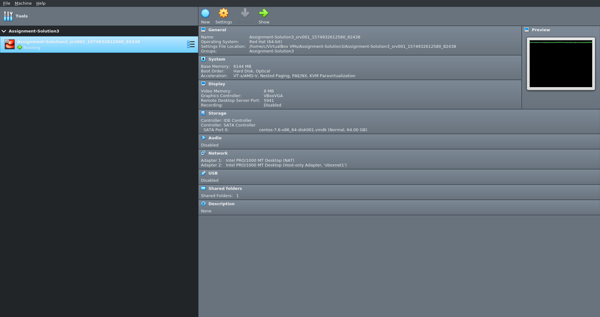
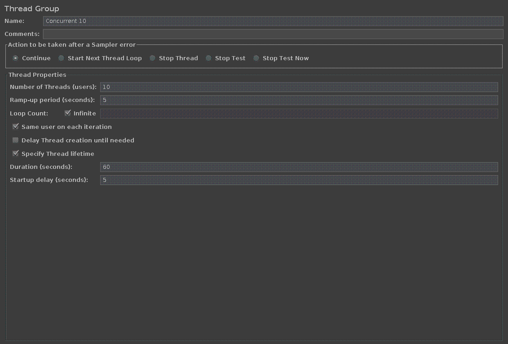
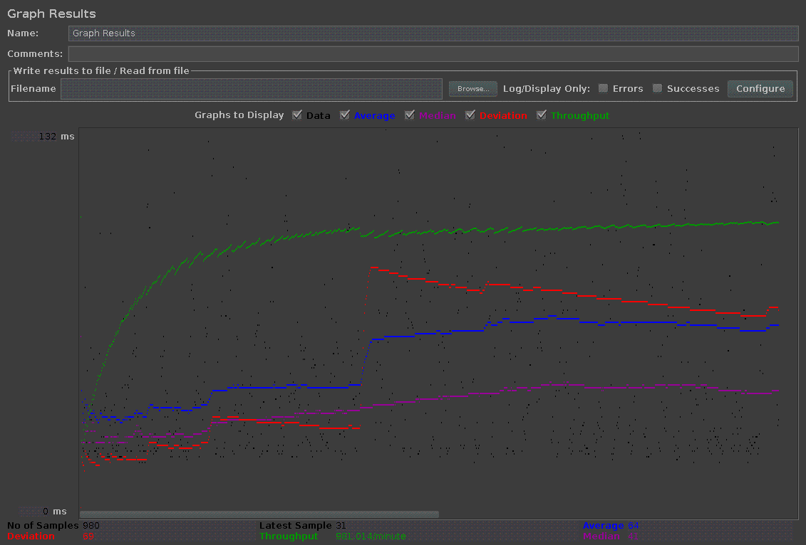
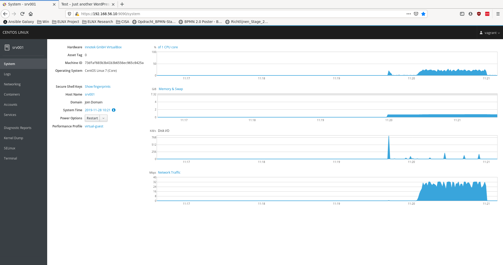
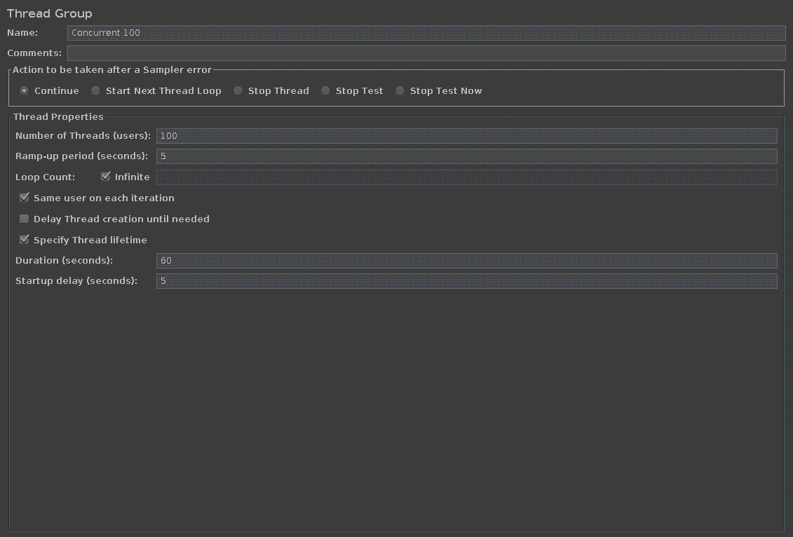
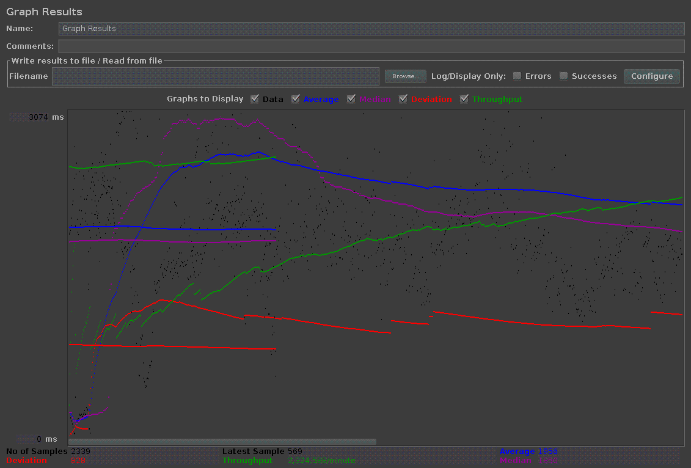
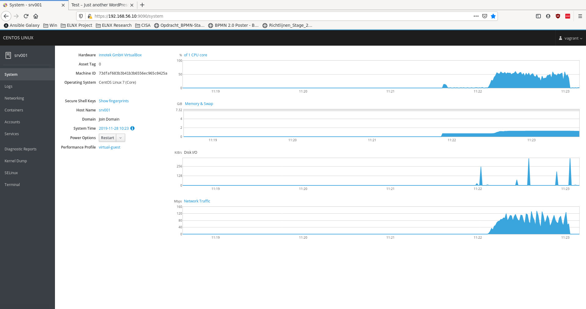
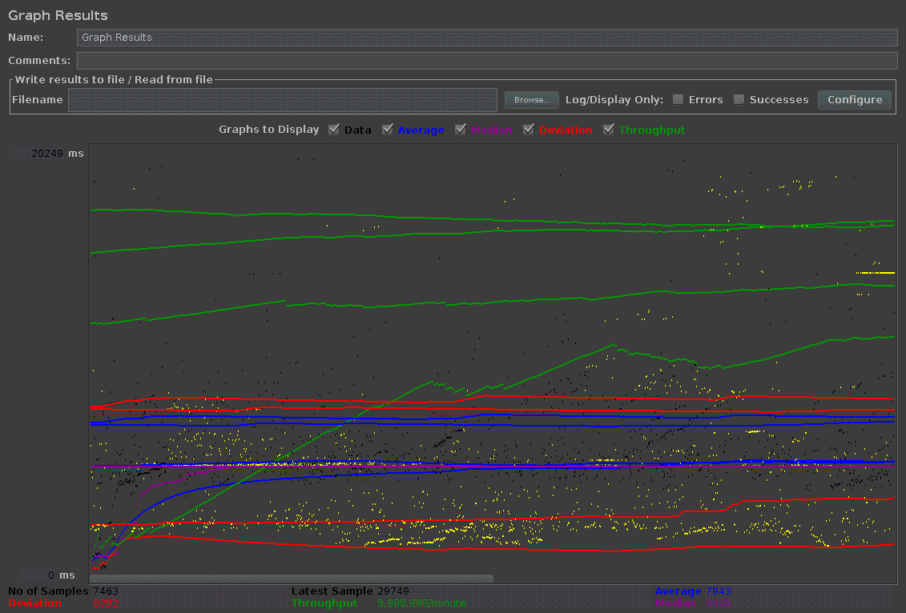
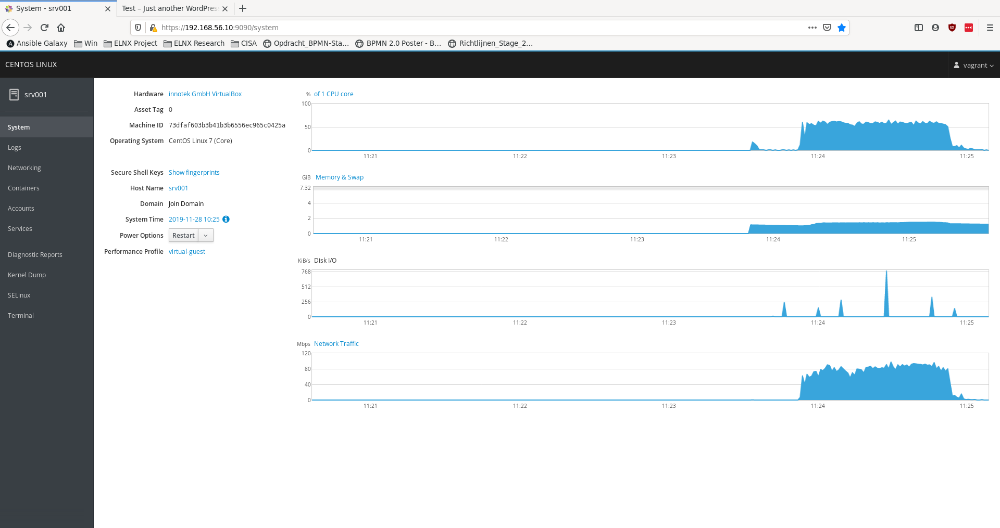

# Enterprise Linux Lab Report

- Student name: Cedric Denoo
- Github repo: <https://github.com/HoGentTIN/elnx-1920-ha-cdenoo.git>

Describe the goals of the current iteration in a short sentence.

## Requirements

- list requirements for this iteration. Use [S.M.A.R.T.](https://en.wikipedia.org/wiki/SMART_criteria) criteria!

## Test plan

Host:
- Install load tester JMeter from https://jmeter.apache.org/download_jmeter.cgi
- Open directory `./Assignment-Solution3/`
- Run `vagrant up`
- Run `vagrant ssh`

Guest:
- Run `cd /vagrant/files/ && docker-compose up -d`

Host:
- Open browser http://192.168.56.10:9090
- Run load tester with script provided in `./Assignment-Solution3/files/Webserver-Load-Test.jmx`

## Documentation

- Test setup before continuing
- Tried to up the server, but apparently installing docker-compose via pip does no longer work
  - Fix: replaced pip installation by curl download and install
- Compare FOSS load testers
  - Gatling (great visualizer)
  - JMeter (java based application - easy to install and use)
- Chose JMeter and installed on host system
- Installed cockpit for local system monitoring

## Test report

### Virtualbox setup

### With 10 concurrent users

- CPU: ~20%
- Memory: ~950 Mb
- Disk: low usage
- Network: ~16 mbps up/down

### With 100 concurrent users

- CPU: ~50%
- Memory: ~1.4 Gb
- Disk: low
- Network: ~48 mbps up/down

### With 1000 concurrent users

- CPU: ~60%
- Memory: ~1.4 Gb
- Disk: low
- Network: ~40 mbps up/down

## Resources

List all sources of useful information that you encountered while completing this assignment: books, manuals, HOWTO's, blog posts, etc.

- [Docker Swarm](https://docs.docker.com/get-started/part4/)
- List all ansible system variables `ansible srv001 -m setup -i .vagrant/provisioners/ansible/inventory/vagrant_ansible_inventory`